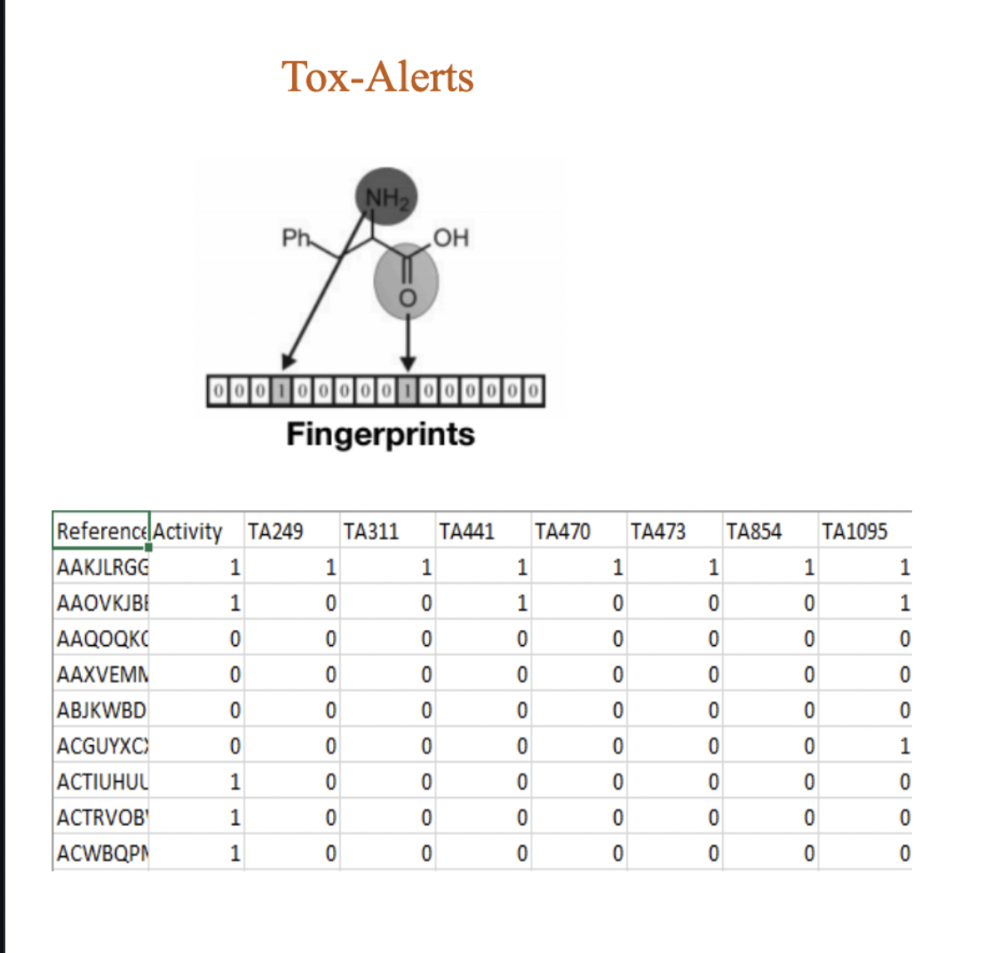
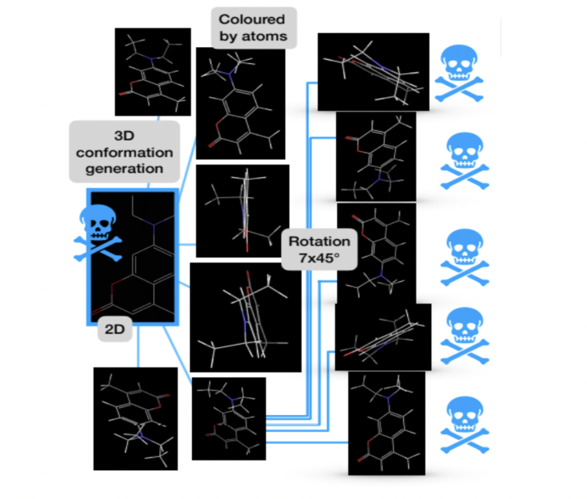
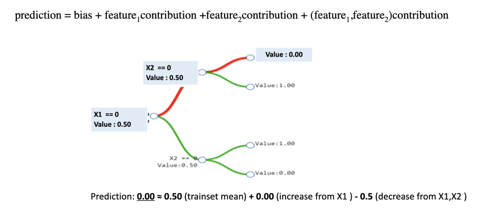
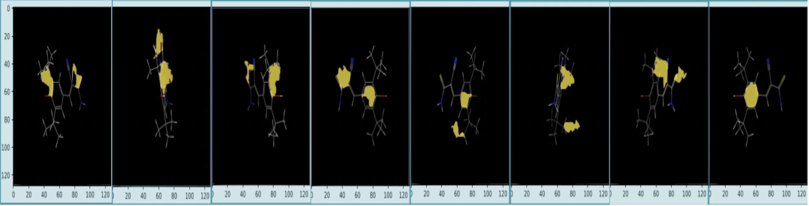

## Understanding Toxicity in the molecules using Explainable AI

Quite often we use models that are highly predictive but not interpretable. This includes Neural Nets, Boosting Algorithms, SVM, etc. However, in some cases, we require to have a model which is accurate as well as interpretable. Ex. Detecting Cancer through Artificial Intelligence. This can be achieved using techniques like Explainable AI. It evaluates the weight of each feature for certain predictions by the Black Box model.

The goal of this research is to understand if certain substructures are inducing the toxicity of the molecule.

### Dataset

We used both image and tabular data for our task and applied explainable AI separately.

**Tabular Data:** Molecular Fingerprint

**Image Data:** Tox-21 challenge 2014

   

The data-augmentation(conformation generation) is done by a researcher at the University of Vienna

### Explainable Models

LIME(Local Interpretable Model-Agnostic) is a technique that approximates any black-box ML/DL model with a local interpretable model to explain each prediction. The basic idea is to approximate the closest decision boundary as linear. We then fit that line with a linear regression model and thus the weights estimates denote the corresponding weights of each predictor. 
Say we want to explain prediction for an observation. We will follow these steps

1. Permute N data points.
2. Calculate the similarity scores for N points with the point of interest
3. Predict this permuted data using the black-box model
4. Fit simple linear regression model on the permuted data weighted by similarity scores
5. Get the weight estimates from the coefficients of the linear model

We used the Jaccard score to estimate the similarity between the two observation

$ w_i = \sqrt{ \dfrac{exp(-d_i)}{wd^2}} $

where d is the distance between two points(Jaccard Similarity in our case).\
wd is a scaling parameter

$$Jaccard Similarity = \dfrac{A\cap B}{A\cup B}$$

### Challenges with LIME

One of the challenges we faced is the low accuracy of the local model. Since the data was very sparse the linear model was not able to accurately predict the local decision boundary, making the weight estimates unreliable. We decided to have chosen a model that can cover the non-linearity as well as is interpretable. 

### Tree Interpreter

We used a tree interpreter as a proxy to understand the local decision boundary for a POI. Each prediction at the locality can be decomposed into a sum of the contribution from each feature. We also dealt with the situation of conditional feature contribution where the feature might be not individually contributing towards the prediction but becomes predictive in the conjuncture with other input features. 

**Conditional Feature Contribution Tree**

 

**Results**

Here is one of the toxic molecules that was predicted as toxic with a probability of 0.87 using a deep neural net. The local linear model was fairly accurate with an accuracy of 0.8. We decided to see if the lime is picking the same segment across conformers.

 

The local model picked 6 out 8 times the same tox alert which shows the promising potential of explainable AI in Toxicity prediction. Similarly, we found some patterns in the tabular data. The details and further references are added to the presentation.

This work was presented at the Gordon Research Conference for computer-aided drug design in the USA.
https://www.grc.org/